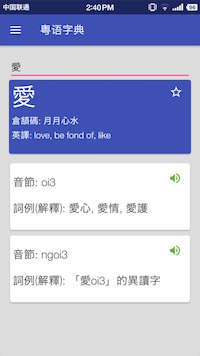
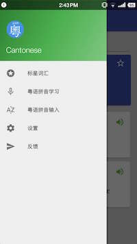

# Cantonese (粤语字典)

## 功能
使用了[粵語審音配詞字庫](http://humanum.arts.cuhk.edu.hk/Lexis/lexi-can/)的数据，一款简单易用的粤语字典软件。支持：

- 输入繁体字，查看倉頡碼、英譯
- 查看该字的香港語言學學會注音，和詞例(解釋)
- 听发音
- 收藏（加星）字

支持API level 19以上（Android 4.4+）。

## 截图

## 下载

- [酷市场](http://www.coolapk.com/apk/com.sjtu.chenzhongpu.cantonese)
- [应用宝](http://sj.qq.com/myapp/detail.htm?apkName=com.sjtu.chenzhongpu.cantonese)
